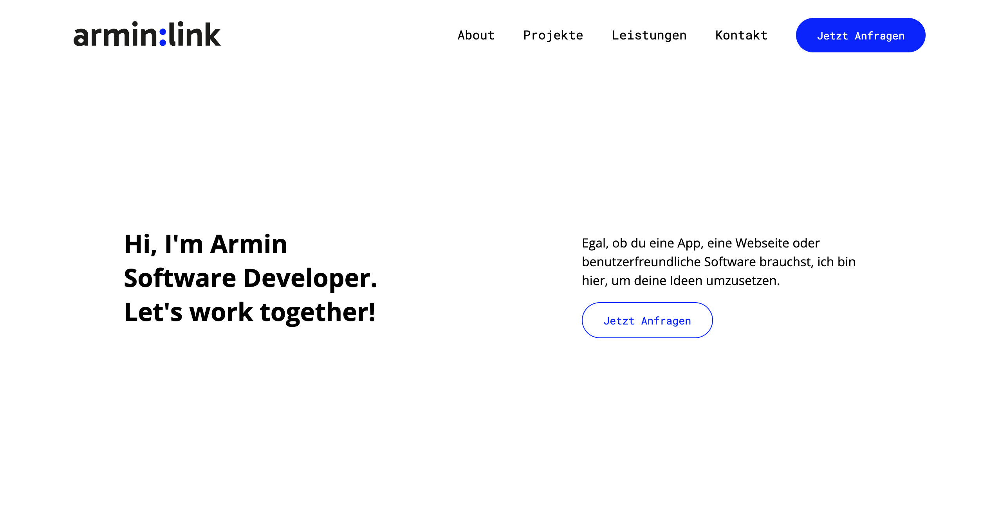
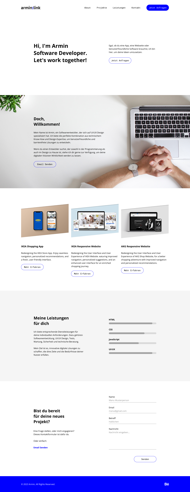

# Portfolio-Website (Demo)

## Beschreibung

Dies ist eine Portfolio-Website, die mit HTML, CSS und JavaScript erstellt wurde. Die Website verfügt über ein Navigationsmenü sowie Abschnitte für "About", "Projekte", "Leistungen" und "Kontakt". Das Design ist responsiv, sodass es auf verschiedenen Bildschirmgrößen und Geräten gut funktioniert.

Diese Website wurde im Rahmen einer IT-Ausbildung am WIFI Wien für eine Pflichtübung **(Modul: HTML und CSS für Web Developer:innen)** entwickelt.

## Funktionen

- **Navigationsmenü**: Das Navigationsmenü ermöglicht es Benutzern, nahtlos zwischen verschiedenen Abschnitten der Website zu navigieren.
  
- **About**: Dieser Abschnitt bietet eine kurze Vorstellung der Person oder des Unternehmens, zu dem die Website gehört.
  
- **Projekte**: Hier können Besucher verschiedene Projekte oder Arbeiten anzeigen, die der Eigentümer der Website abgeschlossen hat. Es können Bilder, Beschreibungen und Links zu den Projekten enthalten sein.
  
- **Leistungen**: Dieser Abschnitt listet die angebotenen Dienstleistungen oder Fähigkeiten auf, die der Eigentümer der Website besitzt.
  
- **Kontakt**: Hier finden Besucher Möglichkeiten, um mit dem Eigentümer der Website in Kontakt zu treten. Dies kann ein Kontaktformular, eine E-Mail-Adresse oder Links zu sozialen Medien sein.

- **Responsives Design**: Die Website wurde entwickelt, um auf verschiedenen Geräten und Bildschirmgrößen gut auszusehen und zu funktionieren. Dies gewährleistet eine optimale Benutzererfahrung, unabhängig davon, ob die Website auf einem Desktop-Computer, Tablet oder Smartphone angezeigt wird.

## Technologien

HTML, CSS, Bootstrap, JavaScript

## Mockup (figma)

